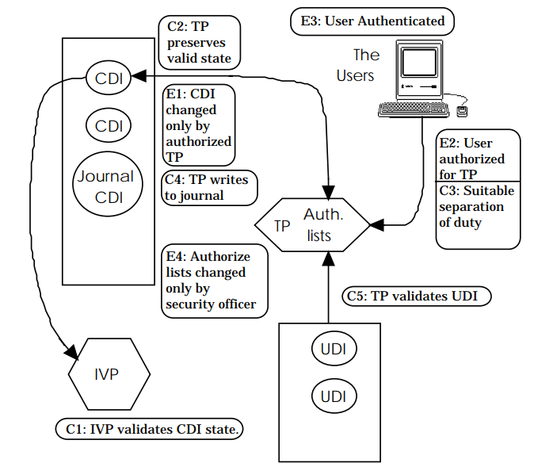

<!--- @file
  Overview.md for Understanding the UEFI Secure Boot Chain

  Copyright (c) 2019, Intel Corporation. All rights reserved. 

  Redistribution and use in source (original document form) and 'compiled'
  forms (converted to PDF, epub, HTML and other formats) with or without
  modification, are permitted provided that the following conditions are met:

  1) Redistributions of source code (original document form) must retain the
     above copyright notice, this list of conditions and the following
     disclaimer as the first lines of this file unmodified.

  2) Redistributions in compiled form (transformed to other DTDs, converted to
     PDF, epub, HTML and other formats) must reproduce the above copyright
     notice, this list of conditions and the following disclaimer in the
     documentation and/or other materials provided with the distribution.

  THIS DOCUMENTATION IS PROVIDED BY TIANOCORE PROJECT "AS IS" AND ANY EXPRESS OR
  IMPLIED WARRANTIES, INCLUDING, BUT NOT LIMITED TO, THE IMPLIED WARRANTIES OF
  MERCHANTABILITY AND FITNESS FOR A PARTICULAR PURPOSE ARE DISCLAIMED. IN NO
  EVENT SHALL TIANOCORE PROJECT  BE LIABLE FOR ANY DIRECT, INDIRECT, INCIDENTAL,
  SPECIAL, EXEMPLARY, OR CONSEQUENTIAL DAMAGES (INCLUDING, BUT NOT LIMITED TO,
  PROCUREMENT OF SUBSTITUTE GOODS OR SERVICES; LOSS OF USE, DATA, OR PROFITS;
  OR BUSINESS INTERRUPTION) HOWEVER CAUSED AND ON ANY THEORY OF LIABILITY,
  WHETHER IN CONTRACT, STRICT LIABILITY, OR TORT (INCLUDING NEGLIGENCE OR
  OTHERWISE) ARISING IN ANY WAY OUT OF THE USE OF THIS DOCUMENTATION, EVEN IF
  ADVISED OF THE POSSIBILITY OF SUCH DAMAGE.

-->
# _Overview_ {#overview}

System firmware, commonly referred to as Basic Input Output System (BIOS), plays an important role in platform security. Running unauthorized firmware components may introduce significant threats by creating a permanent denial of service or introducing persistent malware. In 2011, the National Institute of Standards and Technology ([NIST](https://www.nist.gov/)) published BIOS Protection Guidelines ([SP800-147](https://csrc.nist.gov/publications/detail/sp/800-147/final)). NIST extended the scope to all platform firmware and published Platform Firmware Resiliency Guidelines ([SP800-193](https://csrc.nist.gov/publications/detail/sp/800-193/final)) in 2018\. The goal of those documents is to provide a general guideline for firmware integrity.

### Integrity Models {#integrity-models}

The UEFI Secure Boot chain can be applied to the [Clark-Wilson integrity policy](http://theory.stanford.edu/~ninghui/courses/Fall03/papers/clark_wilson.pdf), developed in 1987\. The Clark Wilson model includes the following concepts:

1.  Data Item:

    1.  Constrained Data Item (CDI)

    2.  Unconstrained Data Item (UDI)

2.  Procedure:

    1.  Integrity Verification Procedure (IVP)

    2.  Transformation Procedures (TPs)

3.  Rule:

    1.  Certification Rule (CR) – integrity monitoring

        1.  **C1**: (Basic: IVP Certification) All IVPs must properly ensure that all CDIs are in a valid state.

        2.  **C2**: (Basic: Validity) All TPs must be certified to be valid. For each TP and each set of CDI that it may manipulate, the security officer must specify a “relation” of the form: (TP, {CDI}).

        3.  **C3**: (Separation of Duty Certification) The list of relation in E2 must be certified to meet the separation of duty requirement.

        4.  **C4**: (Journal Certification) All TPs must be certified to write to an append-only CDI (the log) all information necessary to permit the nature of the operation to be reconstructed.

        5.  **C5**: (Transformation Certification) Any TP that takes a UDI as an input value must be certified to perform only valid transformations, or no transformations, for any possible value of the UDI. The transformation should take the input from a UDI to a CDI, or the UDI is rejected.

    2.  Enforcement Rule (ER) – integrity preserving

        1.  **E1**: (Basic: Enforcement of Validity) The system must maintain the list of relation specified in C2, and must ensure that only TPs certified to run on a CDI manipulate that CDI.

        2.  **E2**: (Enforcement of Separation of Duty) The system must associate a user with each TP and set of CDIs in a list of relations of the form: (User, TP, {CDI}). It must ensure that only executions described in one of the relations are performed.

        3.  **E3**: (User Identity) The system must authenticate the identity of each user attempting to execute a TP.

        4.  **E4**: (Initiation) Only the agent permitted to certify entities may change the list of such entities associated with other entities, specifically the one associated with a TP. An agent that can certify an entity may not have any execute rights concerning that entity.

This model is based on the relationship between authenticated principal, program, and data items. The elements of this relationship are referred to as the “Clark-Wilson Triple” (User, TP, {CDI}). The Clark-Wilson model shows the rules required to meet the security properties of integrity: (from [Blake](https://www.giac.org/paper/gsec/835/clark-wilson-security-model/101747)).

Table 1-1: Clark-Wilson model

| **Property** | **Description** | **Rule** |
| --- | --- | --- |
| **Integrity** | An assurance that CDIs can only be modified in constrained ways to produce valid CDIs. | C1, C2, C5, E1, E4 |
| **Access Control** | The ability to control access to resources. | C3, E2, E3 |
| **Auditing** | The ability to ascertain the changes made to CDIs and ensure that the system is in a valid state. | C1, C4 |
| **Accountability** | The ability to uniquely associate users with their actions. | E3. |

###### Figure 1-1: Clark-Wilson model, From [Lee](http://www.cl.cam.ac.uk/~mgk25/lee-essays.pdf){#clark-wilson-model-from-lee}

Because the Clark-Wilson focuses on duty and transaction, it is more applicable to business and industry processes. Currently, some papers describe how to apply the Clark-Wilson integrity model to the existing system, such as [Windows](https://www.giac.org/paper/gsec/835/clark-wilson-security-model/101747), [Java](https://docplayer.net/36680206-Supporting-real-world-security-models-in-java.html) or [Trusted Computing Group (TCG) security](https://www.semanticscholar.org/paper/A-Comparison-of-the-trusted-Computing-Group-Model-Smith/fa82426d99b86d1040f80b8bd8e0ac4f785b29a6).

### Introduction to the Secure Boot Chain {#introduction-to-the-secure-boot-chain}

According to NIST SP800-147 and SP800-193, the system needs to maintain integrity and availability during the firmware boot process. In firmware, secure boot (aka verified boot) uses a set of policy objects to verify the next entity before execution. For example, to match C5, the system uses the TP (verification procedure) to verify the UDI (untrusted firmware component), transforms the UDI into a CDI (trusted firmware component), and executes it.

In contrast, a trusted boot (aka measured boot) process does not verify the next entity. It only records the digest of the next boot entity to a trusted location, such as a Platform Configuration Register (PCR) in the Trusted Platform Module (TPM). This allows a trusted boot chain to be verified later in the boot process. Many security models use secure boot and trusted boot capabilities in combination for maximum effectiveness.

Table 1-2: Clark-Wilson model in Firmware

| **Property** | **Description** | **Rule** | **Firmware Secure Boot** |
| --- | --- | --- | --- |
| **Integrity** | An assurance that CDIs can only be modified in constrained ways to produce valid CDIs. | C1, C2, C5, E1, E4 | Yes. Firmware needs to verify the next component |
| **Access Control** | The ability to control access to resources. | C3, E2, E3 | No. There is no user concept in secure boot. |
| **Auditing** | The ability to ascertain the changes made to CDIs and ensure that the system is in a valid state. | C1, C4 | Yes, if TCG trusted boot is enabled. TCG event log may record such information. |
| **Accountability** | The ability to uniquely associate users with their actions. | E3. | No. There is no user concept in secure boot. |

### Patterns in the Secure Boot Chain {#patterns-in-the-secure-boot-chain}

Definition:

1.  Firmware[N] - the N level firmware binary. Any firmware layer is updatable.

    Firmware[0] means the component verified by Hardware.

    Firmware[N] means the component verified by Firmware[N-1].

    It may include both code (Firmware[N].Code) and data (Firmware[N].Data).

2.  Firmware[N].Code - the code of the N level firmware binary.

    It may include the verifier (Firmware[N].Code.Verifier.)

3.  Firmware[N].Data - the data of the N level firmware binary.

    It may include the verification policy. (Firmware[N].Data.Policy.)

4.  Firmware[N].Code.Verifier - the verification function of the N level firmware binary.

5.  Firmware[N].Data.Policy - the policy data inside of the N level firmware binary. This data is used by the verification function. Both verification function and policy data have below subcategory:

    1.  Boot - the firmware boot

    2.  FirmwareUpdate - the firmware update (it may or might not include policy data)

    3.  PolicyUpdate - the policy update. It may or might not exist.

    4.  Recovery - the firmware recovery

    5.  Communication - the firmware runtime communication

6.  Hardware – the hardware, including Register Transfer Level (RTL) and register. The hardware is not updatable. The hardware must be fused when it is shipped to the end user.

There are two types of verification:

1.  The verifier for boot (verified boot). The read-only code and read-only data are in this category. This category includes both initial installation and upgrade. For example, UEFI Secure Boot is for code installation, or signed capsule update is for code/data upgrade. In most cases, the verification is based upon a crypto-algorithm, such as Secure Hash Algorithm (SHA) or Rivest-Shamir-Adleman Algorithm (RSA). The policy data can be the hash value of the firmware or the public key hash of the firmware. Above 5.a, 5.b, 5.c, 5.d belongs to this type.

2.  The verifier for communication (verified communication). The read/write data are in this category. This category is for cross-boundary data passing such as SMM communication, including the UEFI non-volatile variable. In most cases, the verification is based upon the boundary check, valid range check, etc. Above 5.e belongs to this type.

#### Patterns for Verified Boot {#patterns-for-verified-boot}

Table 1-3: Patterns for Verified Boot

| **Item** | **Entity** | **Provider** | **Location** |
| --- | --- | --- | --- |
| **TP** | Firmware[N].Code.Verifier.Boot (Firmware[N].Data.Policy.Boot, Firmware[N+1]) | Firmware Owner | Same as Firmware[N] |
| **CDI** | Firmware[N] | Firmware Owner | Originally on Flash, loaded into RAM by Firmware[N-1] |
| **UDI** | Firmware[N+1] | Firmware Owner | Originally on Flash, loaded into RAM by Firmware[N] |

NOTE: If N == 0, Firmware[-1] means the hardware.

#### Patterns for Verified Policy Update {#patterns-for-verified-policy-update}

Table 1-4: Patterns for Verified Policy Update

| **Item** | **Entity** | **Provider** | **Location** |
| --- | --- | --- | --- |
| **TP** | Firmware[N].Code.Verifier.PolicyUpdate (Firmware[N].Data.Policy.PolicyUpdate, Firmware[N].Data.Policy:New) | Firmware Owner |  |
| **CDI** | Firmware[N].Code.Verifier.PolicyUpdate + Firmware[N].Data.Policy.PolicyUpdate | Firmware Owner | In an isolated execution environment. As such the rest of Firmware[N] cannot tamper with it. |
| **UDI** | Firmware[N].Data.Policy:New | Policy Data Owner | Memory, loaded into an isolated environment, by Firmware[N]. Code.Verifier. PolicyUpdate |

*   #### Patterns for Verified Firmware Update {#patterns-for-verified-firmware-update}

Table 1-5: Patterns for Verified Firmware Update

| **Item** | **Entity** | **Provider** | **Location** |
| --- | --- | --- | --- |
| **TP** | Firmware[N].Code.Verifier.FirmwareUpdate (Firmware[N].Data.Policy.FirmwareUpdate, Firmware[N]:New) | Firmware Owner |  |
| **CDI** | Firmware[N] | Firmware Owner | Flash unlockable environment, loaded by Firmware[N-1] |
| **UDI** | Firmware[N]:New | Firmware Owner | Flash unlockable environment, loaded by original Firmware[N] |

*   #### Patterns for Verified Recovery {#patterns-for-verified-recovery}

Table 1-6: Patterns for Verified Recovery

| **Item** | **Entity** | **Provider** | **Location** |
| --- | --- | --- | --- |
| **TP** | Firmware[N].Code.Verifier.Recovery (Firmware[N].Data.Policy.Recovery, Firmware[N+1]:Recovery) | Firmware Owner |  |
| **CDI** | Firmware[N] | Firmware Owner | Originally on flash, loaded into RAM by Firmware[N-1] |
| **UDI** | Firmware[N+1]:Recovery | Firmware Owner | Originally on recovery storage (Flash, USB, Hard drive), loaded into RAM by Firmware[N] |

*   #### Patterns for Verified Runtime Communication {#patterns-for-verified-runtime-communication}

Table 1-7: Patterns for Verified Runtime Communication

| **Item** | **Entity** | **Provider** | **Location** |
| --- | --- | --- | --- |
| **TP** | Firmware[N].Code.Verifier.RuntimeCommunication (Firmware[N].Data.Policy.RuntimeCommunication, Data:New) | Firmware Owner |  |
| **CDI** | Firmware[N].Code.Verifier.RuntimeCommunication + Firmware[N].Data.Policy.RuntimeCommunication | Firmware Owner | In an isolated execution environment. As such the rest of Firmware[N] cannot tamper it. |
| **UDI** | Data:New | Any | Memory, loaded into an isolated environment, by Firmware[N]. Code.Verifier. PolicyUpdate.   This can be any Data, as long as the format is known by the producer and consumer.|

### Comparing Clark-Wilson and UEFI Secure Boot {#comparing-clark-wilson-and-uefi-secure-boot}

The following table illustrates how the UEFI Secure Boot Chain maps to Clark-Wilson certification and enforcement rules.

Table 1-8: Comparison between Clark-Wilson and Secure Boot Chain

| **Rule** | **Clark-Wilson** | **Secure Boot Chain** |
| --- | --- | --- |
| **C1** | The system will have an IVP for validating the integrity of any CDI. | Not applied today. No one validates the CDI.  The integrity may be verified by using a signature check. If TCG trusted boot is enabled, PCR validation can also be done. |
| **C2** | The application of a TP to any CDI must maintain the integrity of that CDI | Not applied. No User in UEFI.  UEFI does not provide isolation. Ideally, the TP should not change CDI not managed by TP. But the reality is hard to enforce.  SMM might be OK. ? |
| **C3** | A CDI can only be changed by a certified TP. Separation of duties / least privilege. | Not applied. No User in UEFI. Similar to C2\. Only SMM has isolation.  Data in SMM can only be changed in SMM. But SMM only used for UEFI Secure Boot authenticated variable trust anchors, and Intel® BIOS Guard update. |
| **C4** | TP actions are logged. | TPM Event Log |
| **C5** | TP actions on UDIs result in valid CDIs. | YES. Input Verification – secure boot chain |
| **E1** | Only certified TPs may act on CDIs. | The verification TP is inside of verified firmware. |
| **E2** | Subjects may access CDIs only through TPs for which they are authorized. | Not applied. No User in UEFI.  All code in same privilege, except SMM. |
| **E3** | Subjects attempting to execute a TP must first be authenticated. | SMM |
| **E4** | Only administrators can specify TP authorizations. | NO. CPU – hardware owner. |